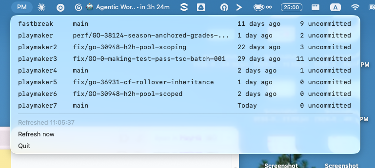

# playmaker-status

A macOS menu-bar app that shows the git status of each of your local repo checkouts at a glance — current branch, how long since the last commit, and the number of uncommitted changes. Click a repo to jump to its [cmux](https://cmux.com) workspace.

It discovers repos by scanning folders you configure (e.g. `~/dev`, `~/dev2`) for directory names matching one or more regexes (e.g. `playmaker\d*`, `fastbreak\d*`).



---

## Install with an AI agent

Paste this into an agent (e.g. Claude Code) running in a terminal on your Mac:

```
Install and configure the playmaker-status menu-bar app from this repo for me.

1. Make sure `uv` is installed (https://docs.astral.sh/uv/). If not, install it.
2. From the repo root, run `uv sync` to create the venv and install dependencies.
3. Run `uv run main.py --cli` once to generate the default config at
   ~/.config/playmaker-status/config.toml, then Ctrl-C to stop.
4. Ask me which folders my repos live in and what naming pattern(s) they follow,
   then edit ~/.config/playmaker-status/config.toml accordingly:
     - scan_dirs: the folders to scan (supports ~ and $ENV_VARS)
     - repo_pattern: a regex string, or a list of regexes; a directory is shown
       if its name FULLY matches any of them
   Leave refresh_seconds and title at their defaults unless I ask otherwise.
5. Launch the menu-bar app with `uv run main.py --no-cli` and confirm my repos
   appear in the menu-bar dropdown.
```

---

## Requirements

- **macOS** (it's a menu-bar app; uses `rumps` + AppKit)
- **Python 3.11+** (uses the stdlib `tomllib`)
- [**uv**](https://docs.astral.sh/uv/) for dependency management
- *(optional)* [**cmux**](https://cmux.com) — only needed for the click-to-open-workspace feature

## Manual install

```sh
uv sync                  # create .venv and install dependencies
uv run main.py           # run it
```

## Running

| Command | Mode |
| --- | --- |
| `uv run main.py` | Menu-bar app **and** prints a refreshing table to the terminal |
| `uv run main.py --no-cli` | Menu-bar app only (no terminal output) — best for running in the background |
| `uv run main.py --cli` | Terminal table only, no menu-bar icon (handy over SSH / for a first run) |

The menu bar shows a short title (default `PM`); click it to see the per-repo status, a "Refresh now" item, and "Quit".

## Configuration

On first run, a commented sample is written to `~/.config/playmaker-status/config.toml`. Edit it and **restart the app** to apply changes.

| Key | Default | Description |
| --- | --- | --- |
| `scan_dirs` | `["~/dev", "~/dev2"]` | Folders to scan. `~` and `$ENV_VARS` are expanded. |
| `repo_pattern` | `"playmaker\\d*"` | A regex **string**, or a **list** of regexes. A directory is shown if its name *fully* matches any of them. |
| `refresh_seconds` | `60` | How often the status refreshes. |
| `title` | `"PM"` | The menu-bar title. |

Example with multiple patterns:

```toml
scan_dirs = ["~/dev", "~/dev2", "~/work/$USER/projects"]
repo_pattern = ["playmaker\\d*", "fastbreak\\d*"]
refresh_seconds = 60
title = "PM"
```

Notes:
- Patterns are matched against the directory **name only**, anchored as a full match (`^(?:…)$`), so `myrepo\d*` will not match `myrepository`.
- A malformed config is ignored with a warning on stderr — the app falls back to defaults rather than crashing.

## Clicking a repo (cmux)

Clicking a repo row tries to open it in cmux:
1. It looks for an existing cmux workspace whose current directory **is** that repo and focuses it.
2. If none exists, it opens the repo in a new cmux workspace.
3. Either way, cmux is brought to the foreground.

If cmux isn't installed, clicks simply do nothing — the rest of the app works fine.

## Run at login (optional)

To keep the menu-bar app running across reboots, create a LaunchAgent. Save the following as `~/Library/LaunchAgents/com.user.playmaker-status.plist`, replacing `/ABSOLUTE/PATH/TO/playmaker-status` with this repo's path and the `uv` path with the output of `which uv`:

```xml
<?xml version="1.0" encoding="UTF-8"?>
<!DOCTYPE plist PUBLIC "-//Apple//DTD PLIST 1.0//EN" "http://www.apple.com/DTDs/PropertyList-1.0.dtd">
<plist version="1.0">
<dict>
  <key>Label</key>            <string>com.user.playmaker-status</string>
  <key>ProgramArguments</key>
  <array>
    <string>/ABSOLUTE/PATH/TO/uv</string>
    <string>run</string>
    <string>main.py</string>
    <string>--no-cli</string>
  </array>
  <key>WorkingDirectory</key> <string>/ABSOLUTE/PATH/TO/playmaker-status</string>
  <key>RunAtLoad</key>        <true/>
</dict>
</plist>
```

Then load it:

```sh
launchctl load ~/Library/LaunchAgents/com.user.playmaker-status.plist
```
